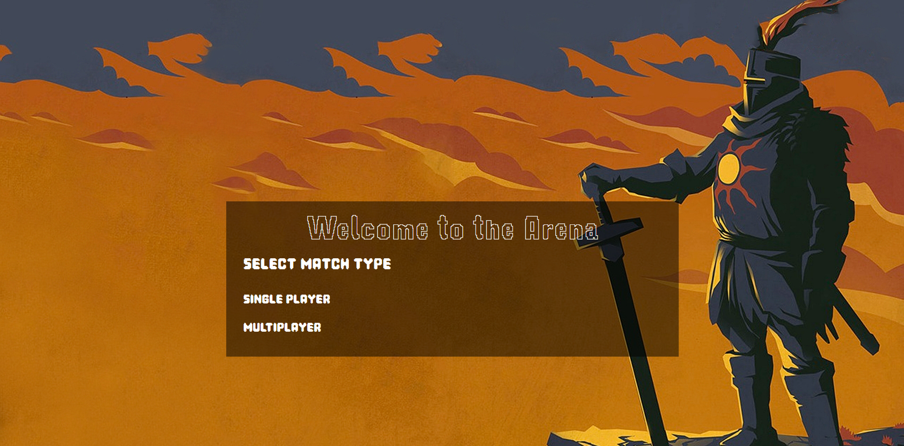
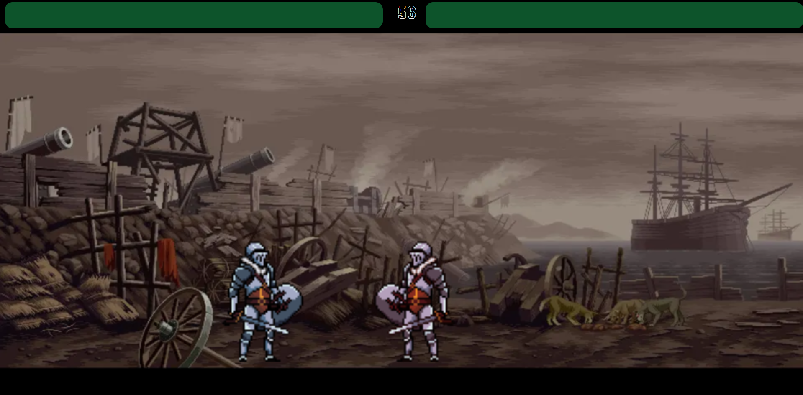
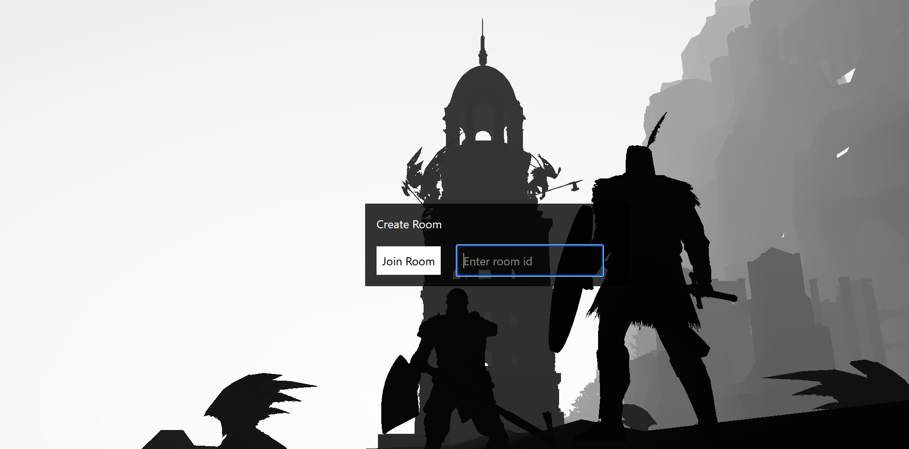

# Darklash


## Description
A web-based 2D fighting game with single and multiplayer(a little buggy but ok ..) support ..

## Screenshots
<div> 


</div>

## Setup

```
git clone https://github.com/Waqibsk/Darklash.git
cd Darklash
```


### Frontend
1. go to the `client` directory.
2. install dependencies.
```
npm install
```
3. start frontend 
```
npm run dev
```

### Backend
1. go to the `server` directory.
2. install dependencies.
```
npm install
```
3. Run backend
```
npm start 
```

